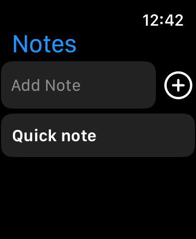

# Notes for watchOS

## Description

A simple quick notes app. Write notes that are saved in Apple Watch memory between sessions. The app works without Internet.\
Needs a lot of refactoring

## Screenshots

    

    

    

    

## P. S.

I made this app just for a quick look how everything works on watchOS. It is not really completed, but the base is implemented. This app helped me in future to understand how to create a [Telegram client](https://github.com/levochkaa/BetterTG) for watchOS.